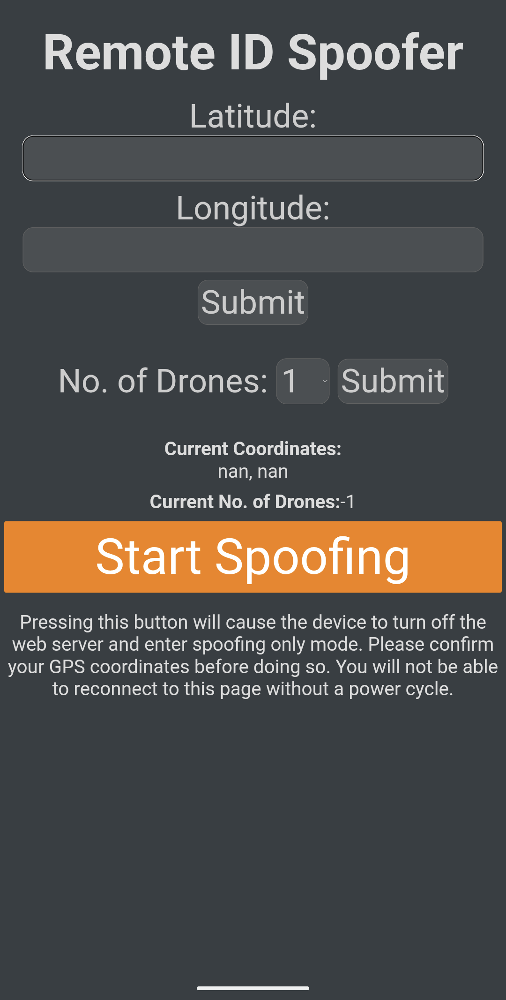
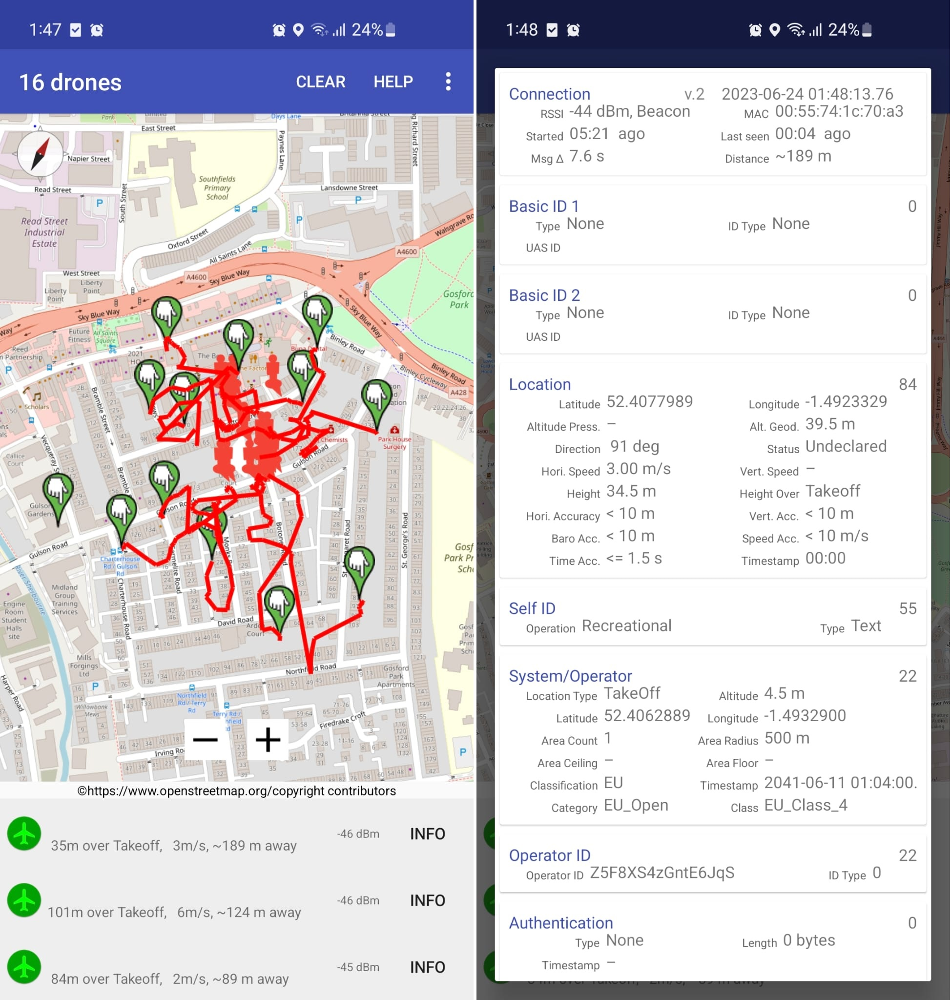

# RIDS - Remote ID Spoofer 
## Like the original with dark theme

An ESP32 / ESP8266 Drone RemoteID Spoofer.
Built based on work done by [sxjack](https://github.com/sxjack/uav_electronic_ids) and [SpacehuhnTech](https://github.com/SpacehuhnTech/esp8266_deauther).
I stand on the shoulders of giants.

Spawn up to 16 different fake drones broadcasting RemoteID, with them all flying in random directions around a particular GPS location.

Do check that whatever device you're using to detect the drones can sniff packets from the air fast enough.
If you're using OpenDroneID available on the App Store or Play Store, you'll have to disable scan throttling for your device, and run the app for ~5-10 minutes before all 16 drones are actually "in the air".
You may also have to switch off Wi-Fi, disconnecting from your usual local network on your Android device, for the Wi-Fi chip to be able to scan.

)
 

## Installation

1. You need the [Arduino IDE](https://www.arduino.cc/en/software).
2. Open the file `RemoteIDSpoofer/RemoteIDSpoofer.ino`. [if needed add http://arduino.esp8266.com/stable/package_esp8266com_index.json to board manager in preferences] 
3. Now go to `Tools` > `Boards` > `Boards Manager`, search `esp8266` (or `esp32` if you're using an ESP32) and install `ESP8266 Boards` (or `esp32` by either vendors).
4. Select your board at `Tools` > `Board` > `ESP8266 Boards` (or `esp32`). It's most likely the `Generic ESP8266 Module`.
5. Plug in your device, and select its COM port at `Tools` > `Port`.
6. Press `upload`, or use Ctrl+U.
7. The device should start broadcasting RemoteID packets generated for random flying machines.

## Usage

**Pro Tip**:
There is no need to do these steps everytime you use the device, once the parameters are set, they are remembered across power cycles.
Configuration is only needed when when parameter change is desired.

1. After the installation steps, connect to the wireless access point `RIDS` using the password `Dr0n3Sp00f3r` on any device, a smartphone will work well enough.
2. Go to the website `192.168.4.1` on the connected device.
3. There, input your own GPS coordinates.
4. Set how many drone to spawn.
5. Start spoofing!

> If no GPS coordinates are used within 2 minutes of startup, the device will automatically go into spoofing mode and you will not be able to change the coordinates without a power cycle.

## Configuration

Theme and WiFi AP setting are in frontend.cpp if you want to make some other change.

## To-Do List

- [ ] Do not forget to check the original project

## Disclaimer

This repository and its code are intended for educational purposes only.
Neither the ESP8266, nor its SDK were meant or built for such purposes.
Bugs can occur!

It is also (probably) illegal to be broadcasting fake RemoteID packets in public airspace, in the same way that spoofing ADS-B packets is illegal.
Whatever manner you wish to use this on is at your own discretion, we don't take any responsibility for what you do with this software.
